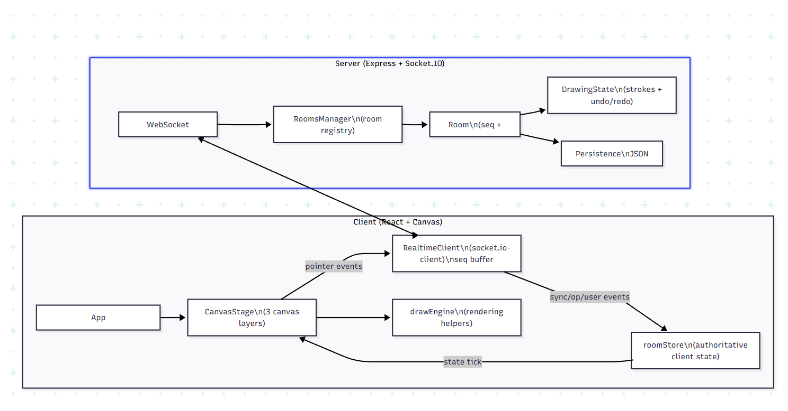
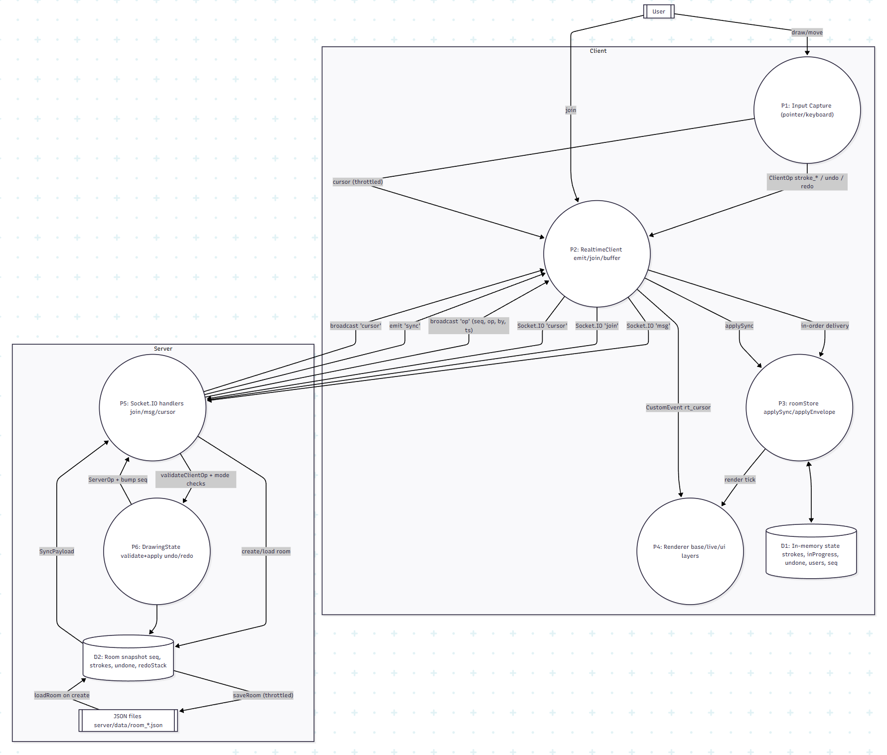
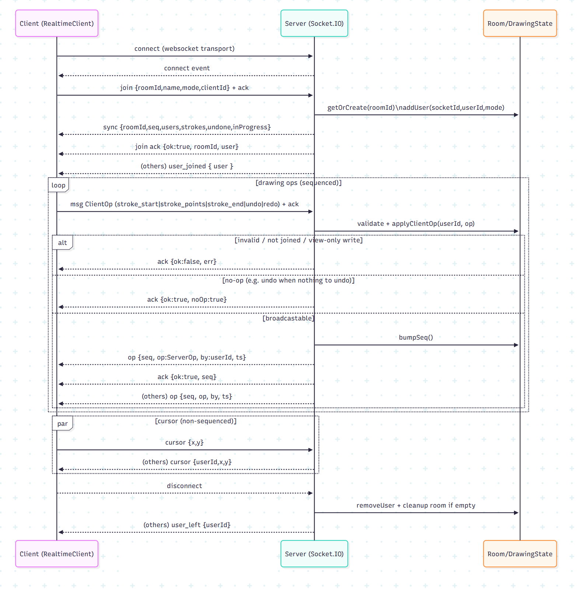
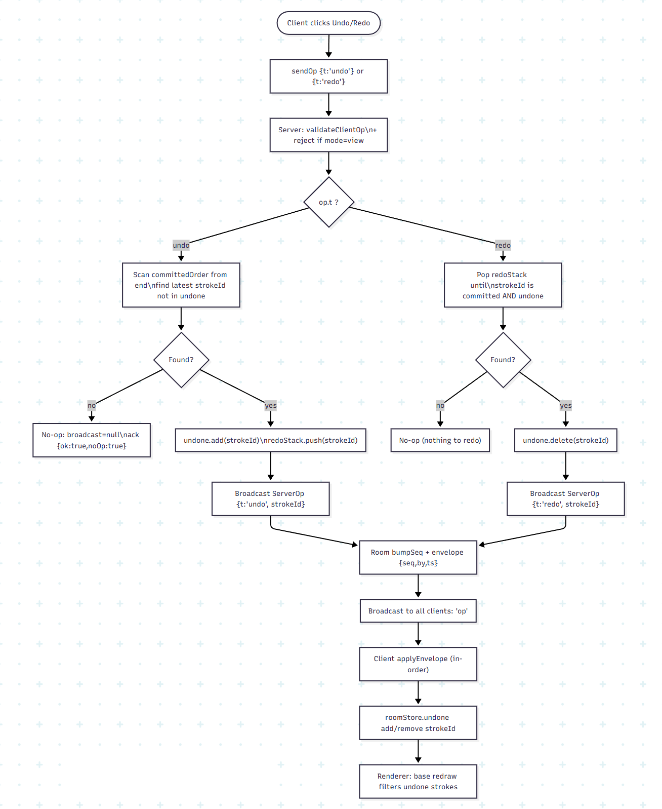
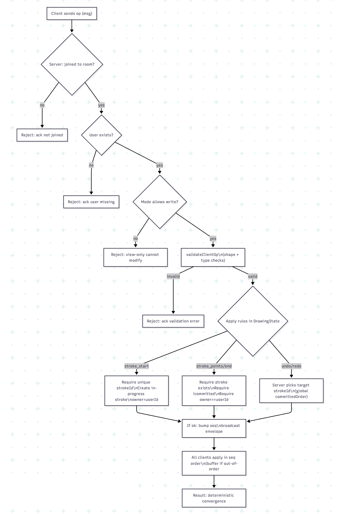

# Architecture

> All architecture diagrams live in the root `./images/` folder.

## Overview

### Client responsibilities (see `App.tsx`, `socket.ts`, `roomStore.ts`, `CanvasStage.tsx`)
- UI selects tool/color/width, joins a room, triggers undo/redo.
- `RealtimeClient` manages the Socket.IO connection + in-order delivery using seq buffering.
- `roomStore` is the single source of truth for strokes, in-progress strokes, users, and the undone set.
- `CanvasStage` renders using three layers: **base** (committed), **live** (in-progress), **UI** (cursors/HUD).

### Server responsibilities (see `server.ts`, `rooms.ts`, `drawing-state.ts`, `storage.ts`)
- Validates ops, assigns a **global per-room sequence** number, broadcasts op envelopes to everyone.
- Maintains per-room `DrawingState` and periodically persists it to disk.

---

## System Flowchart

**What this diagram shows**
- The complete end-to-end lifecycle: **Join → Sync snapshot → Draw ops → Broadcast → Render**.
- The split between client-side **local feel** (preview + batching) and server-side **authoritative ordering**.
- Where undo/redo sits in the pipeline (as just another ordered op in the stream).

**Why it matters**
- Even with many users drawing simultaneously, the system stays deterministic because everyone eventually applies the same ordered op log.

---

## Data Flow Diagram

**What this diagram shows**
- The **authoritative ordering is on the server**: every broadcasted operation gets a monotonically increasing `seq` per room (see `server.ts`, `rooms.ts`).
- The client treats `seq` as the source of truth:
  - `sync.seq` sets the baseline, then the next expected envelope is `sync.seq + 1` (see `socket.ts`).
  - If envelopes arrive out-of-order, they are stored in `pending` until missing `seq` numbers arrive.
- Rendering is deterministic because state is derived from the same ordered log across clients.

**Key takeaway**
- Your UI can be fast and optimistic, but correctness comes from **server-ordered events**.

---

## WebSocket Protocol

**Transport**
- Socket.IO with `transports: ["websocket"]` (client) and CORS limited to `http://localhost:5173` (server).  
  See `socket.ts` and `server.ts`.

**Events**
- `join` → server validates payload, adds user, emits sync snapshot, acks join, and notifies others with `user_joined`.
- `msg` carries drawing operations; server responds with `ack` and broadcasts op envelopes.
- `cursor` is intentionally **not sequenced** (lower importance, high frequency).

**Payloads**
- The operation shapes are defined in `protocol.ts` (client) and `protocol.ts` (server).

**Why this diagram exists**
- It highlights which messages are **reliable + ordered** (`msg` with seq) vs. **best-effort** (`cursor`).

---

## Undo/Redo Strategy (Global)

**It’s global (shared across all users)**
- The server chooses the target stroke by scanning the global `committedOrder` (see `drawing-state.ts`).

**Key server data structures**
- `committedOrder: string[]` — total order of committed strokes.
- `undone: Set<string>` — tombstones; clients simply skip these during redraw.
- `redoStack: string[]` — “last undone, first redo” stack.

**Important behavior**
- A new committed stroke (`stroke_end`) clears `redoStack` (classic rule: new action breaks the redo chain).
- Clients don’t try to guess what gets undone; they wait for `{ t: "undo", strokeId }` from the server so all clients converge.

**Why this works**
- Undo/redo becomes just another ordered event in the same `seq` stream → consistent across all users.

---

## Performance Decisions

**Layered canvases (see `CanvasStage.tsx`)**
- **Base** redraws from committed strokes.
- **Live** redraws only in-progress strokes.
- **UI** draws cursors and overlays.

This avoids repainting “everything” every pointer move and keeps compositing simple.

**Network throttling/batching (see `CanvasStage.tsx`)**
- Brush/eraser points are flushed roughly once per frame (`setTimeout(..., 16)`), sending a small batch of points.
- Cursors are throttled (ignore tiny movements and very frequent updates).

**Server safety + stability (see `protocol.ts`, `rooms.ts`)**
- `stroke_points` capped to 200 points per message to avoid huge payloads.
- Persistence throttled (at most once per 2 seconds per room) to reduce disk churn.

---

## Conflict Resolution

**What “conflicts” exist and how they’re resolved**
- **Concurrent drawing** is not a conflict:
  - Each stroke has a unique `strokeId` and is owned by the creator.
  - Different users draw simultaneously; server interleaves ops by assigning a single global `seq` stream per room (see `server.ts`).

- **Stroke ownership conflicts** (two users trying to append/end the same stroke) are prevented:
  - Server rejects `stroke_points` / `stroke_end` unless `rec.userId === userId` (see `drawing-state.ts`).

- **Out-of-order delivery conflicts** (network reordering) are handled on the client:
  - Client buffers envelopes until missing `seq` arrives, ensuring all clients apply the same ordered log (see `socket.ts`).

- **Undo/redo conflicts** (two users undo at the same time) resolve by serialization:
  - Each undo becomes an ordered event in the same `seq` stream.
  - The server chooses the target at the moment it processes the request.

---

