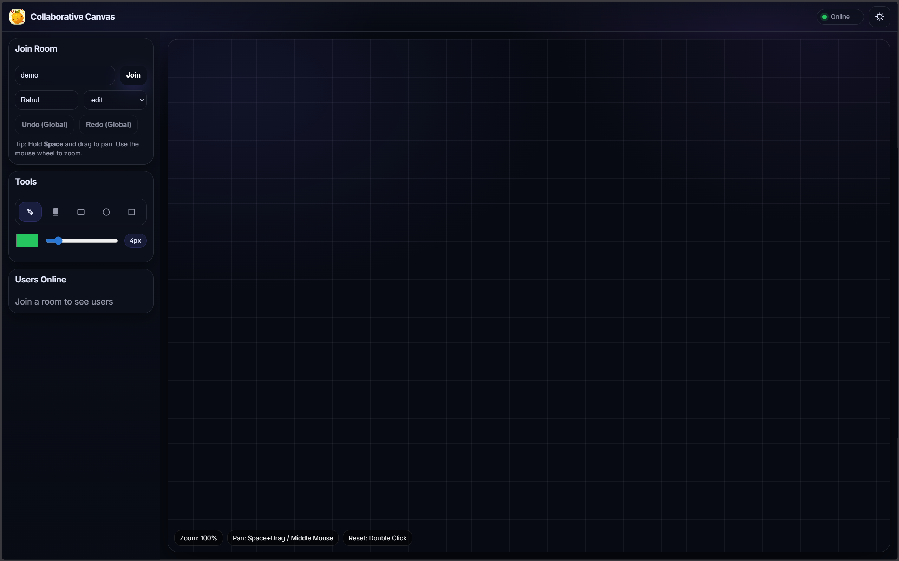
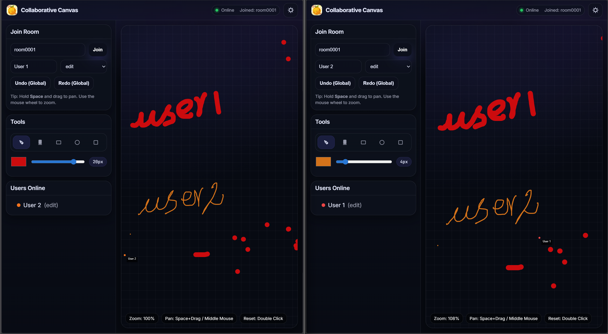
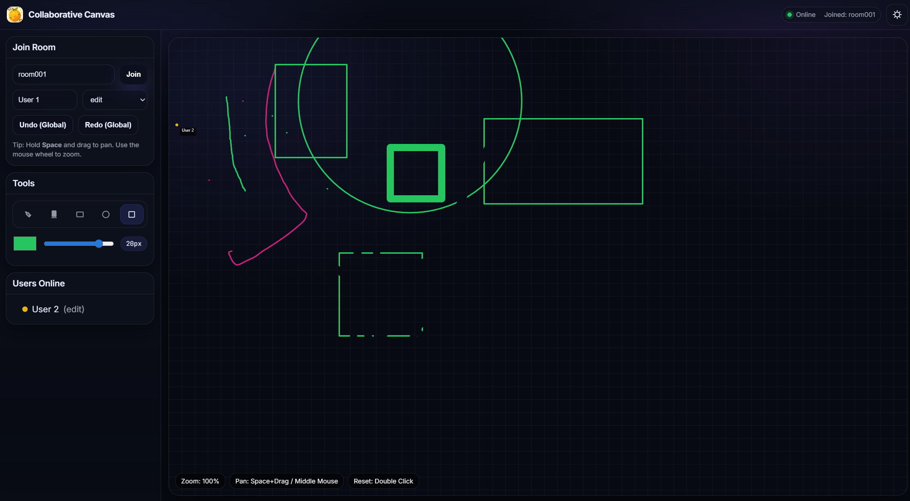
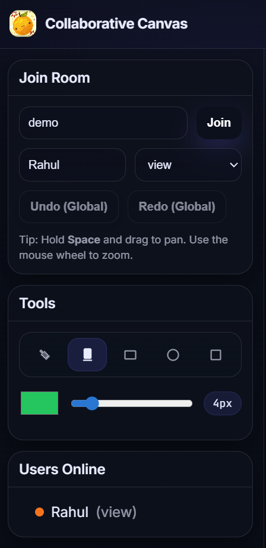

# Collaborative Canvas (Flamapp)

A multi-user, real-time collaborative drawing app built with **React + TypeScript** (client) and **Node.js + Socket.IO** (server). Users can join a shared room, draw together with live stroke streaming, see presence (remote cursors + user list), and use **global undo/redo**.

---

## Table of Contents

- [Overview](#overview)
- [Features](#features)
- [Tech Stack](#tech-stack)
- [Screenshots & Media](#screenshots--media)
- [Quick Start (Local)](#quick-start-local)
- [How to Use](#how-to-use)
- [Persistence (Room Save Files)](#persistence-room-save-files)
- [Protocol & Ordering (How real-time stays consistent)](#protocol--ordering-how-real-time-stays-consistent)
- [Architecture Diagrams](#architecture-diagrams)
- [Troubleshooting](#troubleshooting)
- [Project Structure](#project-structure)
- [Roadmap (optional)](#roadmap-optional)

---

## Overview

Collaborative Canvas is a lightweight “whiteboard” app where multiple users can:

- Join a room by ID (e.g. `demo`)
- Draw using brush/eraser + shapes (rectangle/circle/square)
- Watch live updates across all connected clients
- Use global undo/redo for the whole room
- Pan/zoom the canvas like Excalidraw-style navigation

---

## Features

- **Real-time multi-user drawing** via Socket.IO (WebSocket transport)
- **Tools**
  - Brush
  - Eraser (canvas compositing)
  - Rectangle / Circle / Square
- **Global undo/redo** (server-authoritative and shared across users)
- **Edit vs View mode**
  - Edit: can draw + undo/redo
  - View: read-only (can still pan/zoom and observe)
- **Smooth navigation**
  - Pan: Space + Drag or Middle mouse drag
  - Zoom: Mouse wheel (zoom-to-cursor)
  - Reset view: Double click
- **Presence**
  - User list for the room
  - Remote cursor indicators
- **Persistence**
  - Server saves room state as JSON periodically

---

## Tech Stack

**Client**
- React 18 + TypeScript
- HTML Canvas 2D (no drawing libraries)
- Socket.IO Client
- Vite dev server

**Server**
- Node.js (TypeScript -> `dist/`)
- Express (health endpoint)
- Socket.IO Server
- JSON file persistence

---

## Screenshots & Media
 — join screen / sidebar
 — two browsers drawing in the same room

 — brush/eraser/shapes demo

 — view-mode user watching an editor


## Quick Start (Local)

### Prerequisites
- Node.js **18+** recommended
- npm

---

### 1) Start the server (build first, then run `dist`)
The server is intended to be run from compiled output.

```bash
cd server
npm install
npm run build
node dist/server.js
````

Server runs at:

* [http://localhost:8081](http://localhost:8081)
  Health check:
* [http://localhost:8081/health](http://localhost:8081/health)

Tip: There is also a dev watcher script (`npm run dev`) for development, but the requested run flow is `node dist/server.js`.

---

### 2) Start the client (Vite dev server)

Open a second terminal:

```bash
cd client
npm install
npm run dev
```

Client runs at:

* [http://localhost:5173](http://localhost:5173)

---

### 3) Try it (multi-user)

* Open [http://localhost:5173](http://localhost:5173) in **two tabs** (or two browsers)
* Use the same Room ID in both (example: `demo`)
* Click **Join**
* Draw in one tab and see updates in the other

---

## How to Use

### Join a room

* Enter a **Room ID** (any string works; persisted per room)
* Enter your name
* Pick mode:

  * `edit` can draw + global undo/redo
  * `view` can only watch (still can pan/zoom)

---

### Drawing tools

* **Brush**: freehand stroke
* **Eraser**: removes pixels using canvas compositing
* **Shapes (rectangle/circle/square)**:

  * Click + drag to size
  * Release to commit shape stroke

---

### Navigation controls

* **Pan**: hold `Space` and drag (or use middle mouse drag)
* **Zoom**: mouse wheel (zooms into cursor position)
* **Reset view**: double click canvas

---

### Global undo/redo

Undo/redo is shared across the room:

* Any `edit`-mode user can undo the most recent committed stroke (globally)
* Redo restores the most recently undone stroke (if no newer strokes were committed)

---

## Persistence (Room Save Files)

The server periodically persists room state to disk (about once every ~2 seconds per room, to avoid heavy I/O).

**Location**

* `server/data/`

**File format**

* `room_<roomId>.json` (roomId is sanitized for safe filenames)

**What gets saved**

* committed strokes
* the “undone” set (tombstones)
* commit ordering and redo stack
* the last sequence number (`seq`)

**What does NOT get saved**

* in-progress strokes (if someone refreshes mid-stroke, that partial stroke won’t survive a server restart)

---

### Reset a room

1. Stop the server
2. Delete the matching file from `server/data/` (e.g. `room_demo.json`)
3. Restart the server

---

## Protocol & Ordering (How real-time stays consistent)

This app is server-authoritative for operation ordering.

### High-level idea

* Every meaningful drawing change becomes an operation (`stroke_start` / `stroke_points` / `stroke_end` / `undo` / `redo`)
* The server assigns a monotonically increasing `seq` per room to every broadcast operation
* Clients apply operations strictly in order

### Why the `seq` is important

Network messages can arrive out-of-order. To keep all clients consistent:

* Clients buffer envelopes until missing sequence numbers arrive
* This guarantees deterministic convergence: all clients replay the same ordered log

### Cursor updates are intentionally not sequenced

Cursor messages are:

* frequent
* low importance compared to stroke state

So they’re broadcast without `seq` to reduce overhead/latency.

---

## Architecture Diagrams

Detailed architecture documentation is in `ARCHITECTURE.md`.

In this repo, diagrams are stored as images in `./images` and embedded in `ARCHITECTURE.md`.


---

## Troubleshooting

### “Join failed” or no live updates

* Verify the server is running: [http://localhost:8081/health](http://localhost:8081/health) should return `{ ok: true }`
* Verify the client is running at [http://localhost:5173](http://localhost:5173)

---

### CORS / origin mismatch

The server allows only `http://localhost:5173` by default.

If you run the client on another port/origin, update the server’s allowed origin in `server/src/server.ts`, rebuild, then rerun:

```bash
cd server
npm run build
node dist/server.js
```

---

### Port already in use

If `8081` or `5173` are busy:

* Change the server port in `server/src/server.ts` and rebuild
* Update the client’s server URL in `client/src/App.tsx` to match

---

## Project Structure

```text
collaborative-canvas-1/
├── ARCHITECTURE.md
├── README.md
├── .gitignore
├── images/
│   ├── dataflow.png
│   ├── flowchart.png
│   ├── websocketProtocol.png
│   ├── undo_redo_flowchart.png
│   ├── performance_decision.png
│   └── conflict_resolution.png
├── client/
│   ├── index.html
│   ├── package.json
│   ├── package-lock.json
│   ├── tsconfig.json
│   ├── vite.config.mjs
│   ├── public/
│   └── src/
│       ├── main.tsx
│       ├── App.tsx
│       ├── canvas/
│       │   ├── CanvasStage.tsx
│       │   └── drawEngine.ts
│       ├── net/
│       │   ├── protocol.ts
│       │   └── socket.ts
│       ├── state/
│       │   └── roomStore.ts
│       └── styles/
│           └── app.css
└── server/
    ├── package.json
    ├── package-lock.json
    ├── tsconfig.json
    ├── dist/
    ├── data/
    │   └── room_demo.json
    └── src/
        ├── server.ts
        ├── protocol.ts
        ├── rooms.ts
        ├── drawing-state.ts
        ├── storage.ts
        └── room/
```


## Roadmap (optional)

* Per-user undo/redo (in addition to global)
* Stroke simplification/compression for long sessions
* Better reconnect strategy (replay missing seq range instead of full sync)
* Production deployment guide (configurable CORS + hosted client)

